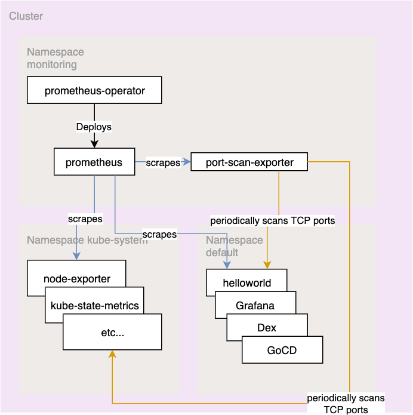

# Presentation for GS

---

## Part 1 - Fix cluster

Several broken configs/typos

----

### Deployment 

- Had `restricted` PodSecurityPolicy assigned
- `MustRunAsNonRoot`
- Fixed by setting a `securityContext` with a non-root `runAsUser` 
  
----

### Service

- There was a typo in the label selector (`heloworld`), so it didn't have any endpoints exposed

----

### Ingress

- wrong host name in
- wrong backend service port (8081 instead of 8080)

---

## Part 2 - Install Prometheus

Use Prometheus Operator and scrape services in the cluster for metrics

----

- used kube-prometheus manifests as starting template
  - left out AlertManager, Grafana, node-exporters, etc...
- created own PSP for Prometheus so it can use required volume types
- Added Service Accounts and Service Monitors for `default` and `kube-system` namespaces

---

## Part 3 - Build a port-scan-exporter

Exporter should scan each Pod and collect metrics about what ports are open.

----

- written in Go
- used simple package `github.com/anvie/port-scanner`
- fetches Pods from all Namespaces and does a TCP port scan on them (except the ones using `hostNetwork`)

----

### Helm Chart to deploy the exporter into monitoring namespace

-  Deployment
-  ClusterRole(Binding)
-  ServiceMonitor
-  GlobalNetworkPolicy (albeit scanning of all the Pods even worked without defining it, so I'm not entirely sure about this one)

----

---

## Thank you for your time!